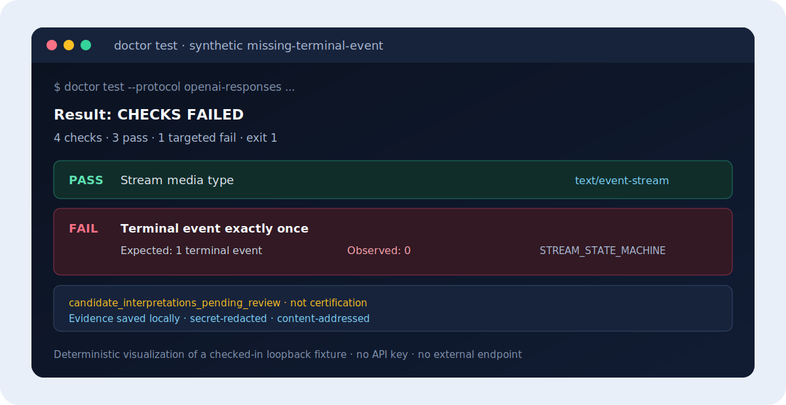

<div align="center">

# AgentAPI Doctor

### 200 OK 不等于兼容。检查协议流，把证据留下来。

一个小巧、local-first 的 CLI：检查“OpenAI-compatible”或 Anthropic-compatible
endpoint 是否真的符合 client 依赖的行为，并生成可复现、可比较、可安全审阅的
脱敏报告。

[](https://github.com/whyiug/agentapi-doctor/releases)
[](https://github.com/whyiug/agentapi-doctor/actions/workflows/ci.yml)
[](https://github.com/whyiug/agentapi-doctor/actions/workflows/codeql.yml)
[](LICENSE)

[快速开始](docs/zh-CN/quick-start.md) ·
[检查内容](#doctor-检查什么) ·
[真实 SDK 案例](docs/cases/openai-python-responses-null-output.md) ·
[离线报告源码](docs/examples/missing-terminal-event-report.html) ·
[English](README.md)

</div>

<p align="center">
  
</p>

## 从下载到得到答案

Linux 和 macOS 无需 Go，即可安装固定的 `v0.1.0-rc.3`：

```sh
curl --proto '=https' --tlsv1.2 -fsSL \
  https://raw.githubusercontent.com/whyiug/agentapi-doctor/v0.1.0-rc.3/install.sh | sh
$HOME/.local/bin/doctor demo
```

固定版本 installer 会先用 `checksums.txt` 校验 release archive，再执行解压。
如果希望先审阅脚本，请下载 [`install.sh`](install.sh)，然后运行
`sh install.sh`。Windows 用户可以从
[GitHub Releases](https://github.com/whyiug/agentapi-doctor/releases/tag/v0.1.0-rc.3)
下载经过校验的 ZIP；[安装文档](docs/installation.md)提供所有平台的 checksum
步骤。

Demo 不需要 API key。它会启动随机 loopback fixture，运行 4 个 lifecycle 检查，
保存本地证据，然后自动停止 fixture：

```text
Profile outcome: COMPATIBLE
Cases: 4 candidate / 4 applicable / 4 executed
Verdicts: PASS 4 | FAIL 0 | WARN 0 | INCONCLUSIVE 0 | SKIPPED 0 | ERRORED 0
```

Demo 成功只验证这个精确的合成 fixture 和已安装 CLI；它不认证其他 endpoint、
SDK、Provider 或部署。

## 检查获授权的 endpoint

不需要初始化项目，也不需要 YAML：

```sh
export DOCTOR_TOKEN='replace-with-a-test-token'

doctor test \
  --base-url 'https://your-endpoint.example/v1' \
  --protocol openai-chat \
  --model 'your-model-id' \
  --auth-env DOCTOR_TOKEN
```

其他 API 形态可选择 `openai-responses` 或 `anthropic-messages`。无认证 endpoint
可省略 `--auth-env`。目标可以位于本机、私有网络或远程，但必须属于你，或已经
明确授权你进行测试。

每次 run 最多发送 4 个请求，共用一个 60 秒 deadline。Token 从指定环境变量
读取，不进入命令参数；请求不会离开配置的 origin，也不跟随 redirect；证据默认
保存在本地 `.agentapi/`。

## Doctor 检查什么

| 基础 smoke test 能看到 | Doctor 还会检查 |
| --- | --- |
| HTTP status | 必需的 response envelope |
| 第一个 SSE chunk | stream media type 和生命周期 |
| 返回了一些文本 | terminal event 是否存在、状态是否正确、是否恰好一次 |
| 一段临时控制台日志 | 与精确 run 绑定、内容寻址、secret-redacted 的证据 |

当前 Quick Check 会为以下任一协议选择 4 个可执行 raw HTTP 检查：

- OpenAI Chat Completions；
- OpenAI Responses；
- Anthropic Messages。

同一结果可以输出为 terminal、JSON、JUnit、SARIF、Markdown 或完全离线的 HTML。
Named baseline 和稳定 exit code 可以直接服务 CI。

## 不只展示成功，也展示失败

当仓库内置的合成 server 故意省略 Responses terminal event 时，即使 media type
看起来正确，Doctor 仍会拒绝该协议流：

```text
Profile outcome: INCOMPATIBLE
Cases: 4 candidate / 4 applicable / 4 executed
Verdicts: PASS 3 | FAIL 1 | WARN 0 | INCONCLUSIVE 0 | SKIPPED 0 | ERRORED 0
PASS  stream media type
PASS  required response envelope
FAIL  terminal event exactly once
PASS  terminal status
```

可以下载[离线失败报告](docs/examples/missing-terminal-event-report.html)并在本地打开，
也可以按 [Synthetic Fixture](docs/getting-started/synthetic-fixtures.md) 文档复现。
这个例子是真实、确定性的 wire/lifecycle observation，但它本身不是一个真实
SDK run，也不是自动根因归因。

## 为什么真实 SDK 会改变答案

只看状态的 smoke test 可能看到 `200 OK` 和 `text/event-stream` 就认为成功，却
没有验证 terminal object 能否被真实 client 使用。当前源码加入了一个刻意收窄、
使用固定版本 OpenAI Python SDK 的反例：

| 对同一条合成协议流的观察 | 结果 |
| --- | --- |
| HTTP/SSE smoke | `200 OK`，并且收到了 `response.completed` |
| Raw terminal object | `output` 是 `null`，而不是固定版本 SDK 所建模的 array |
| OpenAI Python SDK 2.38.0 | 在 event iteration 阶段拒绝该 stream |
| Doctor bundle | 把 `wire.sse`、脱敏 SDK observation 和精确依赖锁关联起来 |

在 Linux amd64 与 CPython 3.12.12 上复现：

```sh
doctor reproduce openai-python-responses \
  --python .venv/bin/python \
  --fixture null-completed-output \
  --bundle ./openai-python-null-output.zip
```

该命令只使用随机 loopback fixture 和合成 token，不联系 Provider，也不读取 API
key。Hash-locked 安装方式和精确证据边界见
[可复跑案例（英文）](docs/cases/openai-python-responses-null-output.md)。该案例只证明
一个冻结版本 SDK 的行为，不代表任何厂商 endpoint 兼容或不兼容。

## 它适合放在哪里

| 你的目标 | 当前更合适的工具 |
| --- | --- |
| 检查一个 key 或 endpoint 是否响应 | `curl` 或 browser checker |
| 交互式探索 model 和 prompt | Web playground |
| 重复检查生命周期并保留可比较证据 | **AgentAPI Doctor** |
| 复现一个已知的 Responses/SDK failure | 使用 Doctor 固定版本 OpenAI Python 案例和 evidence bundle |
| 证明任意 SDK 或 Agent 完整兼容 | 必须让那个精确 client 运行在获授权 endpoint 上；Doctor 不声称已有此覆盖 |

Doctor 不是模型质量 benchmark、Provider 排名、relay 真伪检查或厂商认证服务。
当前 catalog 还包含不可执行的 candidate metadata；精确边界见
[已知限制](docs/known-limitations/README.md)。

## 证据与隐私

- Credential 从环境变量或受保护文件引用读取，并在持久化前脱敏。
- 精确 endpoint、model、plan、profile、pack 和 evidence digest 与 run 绑定，
  因此两次结果可以被可靠比较。
- 结构化 model content 和 tool arguments 不一定匿名，分享前必须人工审阅。
- 目标 Provider 仍会收到有界的合成 prompt，也可能按其政策保留请求。
- 结构检查请求 64 个 output tokens；Chat/Responses 的 terminal-status 检查请求
  512 个，使默认启用 thinking 的模型更可能自然结束。Provider 可能拒绝或忽略
  这些字段，因此它们不是强制成本上限。

只测试你已获得明确授权的系统。

## 为什么需要这个项目

公开案例反复出现同一个缺口：直接请求正常，但 SSE 终态、tool-call delta、严格
Responses event、proxy 或 client state machine 在后续失败。例如
[Open WebUI #21768](https://github.com/open-webui/open-webui/issues/21768)、
[llama.cpp #20607](https://github.com/ggml-org/llama.cpp/issues/20607) 和
[Codex #24973](https://github.com/openai/codex/issues/24973)。

[7 月 13 日精简执行计划](0713-plan.md)记录了社区调研、竞品对比、收缩后的
roadmap 和停止条件。首个 OpenAI Python SDK / Responses 固定版本案例现在已经
可以复跑；下一项证明是外部复用，而不是扩公共 Registry、matrix 或 hosted UI。

## 文档与社区

[快速开始](docs/zh-CN/quick-start.md) ·
[安装](docs/installation.md) ·
[CLI 参考](docs/cli-reference.md) ·
[故障排查](docs/troubleshooting.md) ·
[已知限制](docs/known-limitations/README.md) ·
[真实 SDK 案例（英文）](docs/cases/openai-python-responses-null-output.md) ·
[Roadmap](ROADMAP.md) ·
[全部文档](docs/README.md)

欢迎贡献。请先阅读 [CONTRIBUTING.md](CONTRIBUTING.md)，可以提交一个真实的
compatibility failure 或合成 fixture；安全问题请按 [SECURITY.md](SECURITY.md)
私密报告。请勿在公开 issue 中提交 credential 或未脱敏的 Provider response。

除非文件另有说明，源码和文档采用 [Apache License 2.0](LICENSE)。其他条款见
[DATA_LICENSE.md](DATA_LICENSE.md) 与
[THIRD_PARTY_LICENSES.txt](THIRD_PARTY_LICENSES.txt)。
